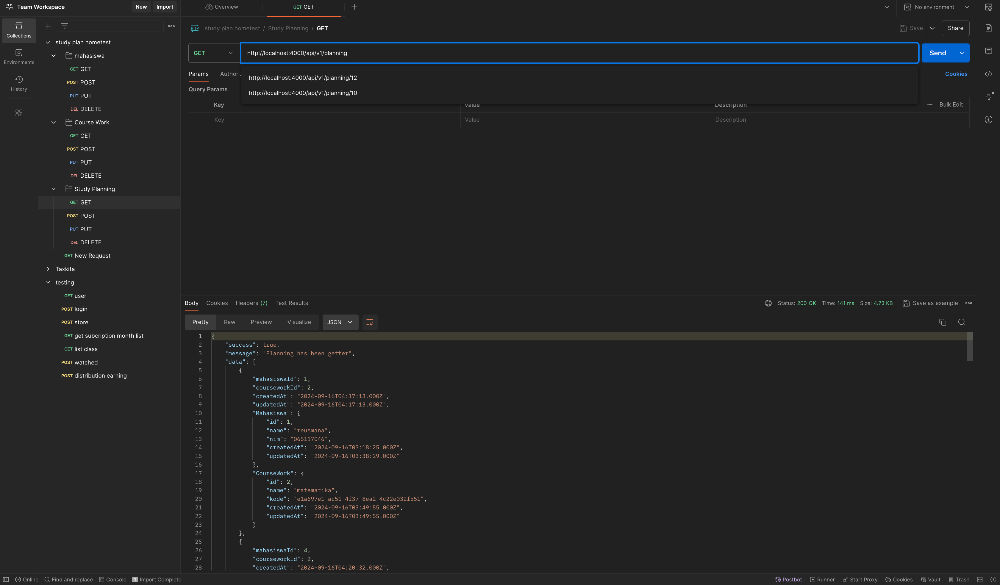

# Rencana Studi API

## How to Run

1. Install dependencies:

   ```bash
   npm install

   ```

2. the create the db on mysql then migrate the db

   ```bash

   npx sequelize-cli db:migrate

   ```

3. then run the apps

   ```bash

   npm start

   ```

4. if you wanna test the api route, you can import the testing postman in folder postman import inside this project
   
